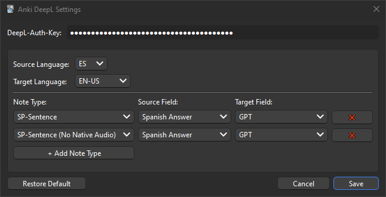

### Description

Uses [DeepL](https://www.deepl.com/en/translator) to translate text in the `Source Field`, and places it into `Target Field`.

`DeepL-Auth-Key` needs to be provided for translations. You can learn how to get one [here](https://developers.deepl.com/docs/getting-started/managing-api-keys).

### How to Install

Code found [here](https://github.com/davidc4747/Anki-DeepL/releases). Unzip the addon into your `addons21` folder.

On Windows: `C:\Users\{username}\AppData\Roaming\Anki2\addons21\`
